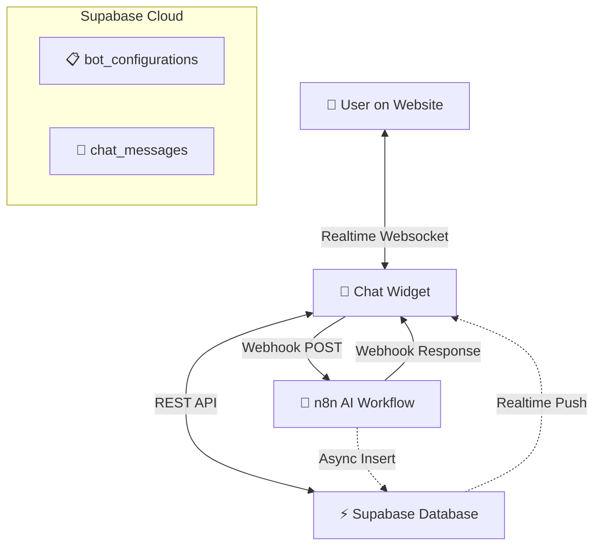

# 📘 The Ultimate Chat Widget Guide

Welcome to the comprehensive documentation for your **Enterprise Realtime Chat Widget**. This guide is designed to be visual, easy to understand, and packed with actionable information.

### [🚀 Click here for the Vercel Deployment Guide](VERCEL_GUIDE.md)

---

## 🏗️ System Architecture

Understanding how the moving parts work together.



---

## ✨ Features at a Glance

| Feature | Description | Technical |
| :--- | :--- | :--- |
| **⚡ Realtime** | Messages appear instantly without refreshing. | Uses `Supabase Realtime` channels on `chat_messages`. |
| **🎨 Theming** | Fully customizable colors, fonts, and texts. | Loaded from `bot_configurations` table on init. |
| **🧠 Memory** | Remembers chat history for returning users. | Uses `localStorage` to persist `sessionId`. |
| **🔒 Secure** | Protected against unauthorized access. | Implements **Row Level Security (RLS)** policies. |
| **🚀 Fast** | Lightweight and dependency-free core. | Vanilla JS, no heavy frameworks like React/Vue required. |
| **🤖 AI Ready** | Built to connect with n8n/LangChain. | Standardized Webhook payload structure. |

---

## 🚀 Quick Start Cards

Follow these "cards" to get up and running in minutes.

### 🃏 Card 1: The Database
> **Goal**: valid Tables and Policies.
> 1.  Log in to your **Supabase Dashboard**.
> 2.  Go to the **SQL Editor** tab.
> 3.  Copy content from `deployment/database/init.sql`.
> 4.  Click **Run**.
> 
> *Result: Your backend is ready!* ✅

### 🃏 Card 2: The Configuration
> **Goal**: Connect Frontend to Backend.
> 1.  Navigate to the `deployment/` folder.
> 2.  Rename `config.example.js` → `config.js`.
> 3.  Open `config.js` in a text editor.
> 4.  Paste your **Supabase URL** and **Anon Key**.
> 
> *Result: Widget knows where to talk!* ✅

### 🃏 Card 3: The Bot
> **Goal**: Create your first assistant.
> 1.  Open `deployment/tools/admin-generator.html` in your browser.
> 2.  Fill in the form (Name, Colors, Webhook URL).
> 3.  Click **Get SQL**.
> 4.  Run that SQL in Supabase.
> 
> *Result: Your bot exists in the database!* ✅

### 🃏 Card 4: The Launch
> **Goal**: See it live.
> 1.  Open `deployment/index.html`.
> 2.  Update the `?botId=` parameter in the HTML to match your new bot.
> 3.  Refresh and Chat!
> 
> *Result: You are live!* 🚀

---

## 🛠️ Configuration Visualizer

The widget is controlled by the `bot_configurations` table. Here is a visual map of what you can control.

### 🎨 Branding & Style
| Config Column | Effect | Visual |
| :--- | :--- | :--- |
| `primary_color` | Main buttons, header, user bubbles | 🟦 Blue / 🟥 Red / etc |
| `background_color` | Widget background | ⬜ White / ⬛ Dark Mode |
| `font_family` | Text style | `Inter`, `Roboto`, `Arial` |
| `logo_url` | Header image | 🖼️ URL to image |

### 💬 Messages & Text
| Config Column | Effect | Example |
| :--- | :--- | :--- |
| `welcome_text` | First message user sees | "Hi! How can I help?" |
| `placeholder_text` | Input field hint | "Type your question..." |
| `start_button_text` | Text on "New Chat" button | "Start Conversation" |

### ⚙️ Behavior & Logic
| Config Column | Effect | Value |
| :--- | :--- | :--- |
| `webhook_url` | Where messages are sent | `https://your-n8n.com/webhook/...` |
| `monthly_message_limit`| Max messages per month | `1000` |
| `enable_typing_animation`| Fake typing delay | `true` / `false` |

---

## 🔌 Integration "Cheat Sheet"

Copy-paste these blocks to add the widget to your platforms.

### 🌐 Standard HTML Site (1-Line Embed)
The easiest way to add the widget. It automatically loads all dependencies.

```html
<script src="https://your-site.com/chat/embed.js?botId=my-bot-01"></script>
```

### 🌐 Advanced Integration (3-Line Embed)
Use this if you need more control or already use Supabase on your site.

```html
<!-- 1. Supabase SDK -->
<script src="https://cdn.jsdelivr.net/npm/@supabase/supabase-js@2"></script>

<!-- 2. Config -->
<script src="https://your-site.com/chat/config.js"></script>

<!-- 3. Widget -->
<script src="https://your-site.com/chat/chat-widget.js?botId=my-bot-01"></script>
```

### ⚛️ WordPress / CMS
1.  Go to **Appearance > Theme File Editor**.
2.  Open `footer.php`.
3.  Paste the **1-Line Embed** code block just before the closing `</body>` tag.
4.  Upload your `embed.js`, `chat-widget.js`, and `config.js` to your Media Library or Server.

---

## 🩺 Troubleshooting Tree

<details>
<summary><strong>❌ "Bot configuration not found"</strong></summary>

*   **Cause**: The `botId` in your URL (`?botId=xyz`) does not match any `bot_id` in the `bot_configurations` table.
*   **Fix**: Check the URL parameter. Check the database table. Ensure `is_active` is `true`.
</details>

<details>
<summary><strong>❌ Messages are checking but not sending</strong></summary>

*   **Cause**: RLS Policies might be blocking inserts.
*   **Fix**: Check `supabase-schema.sql` (or `init.sql`) policies. Ensure "Enable insert for everyone" policy is active on `chat_messages`.
</details>

<details>
<summary><strong>❌ "Connection Error" / Realtime not working</strong></summary>

*   **Cause**: `config.js` is missing or incorrect.
*   **Fix**: Verify `window.SUPABASE_CONFIG` has the correct URL and Key. Open Console (`F12`) to see errors.
</details>

<details>
<summary><strong>❌ Double Messages from Bot</strong></summary>

*   **Cause**: You have both a "Webhook Response" AND an "Async Database Insert" happening.
*   **Fix**: If your n8n workflow inserts into Supabase, do NOT return a JSON body in the Webhook node. Return an empty 200 OK.
</details>

---

## 📁 File Structure Reference

```
deployment/
├── 📄 embed.js                <-- 🪄 1-Line Loader
├── 📄 config.js               <-- 🔑 Keys here
├── 📄 chat-widget.js          <-- 🧠 Brains here
├── 📄 index.html              <-- 🧪 Test here
├── 📂 database/
│   └── 📄 init.sql            <-- 🗄️ Database setup
├── 📂 tools/
│   └── 📄 admin-generator.html <-- 🛠️ Admin UI
└── 📂 docs/                   <-- 📚 More reading
```
